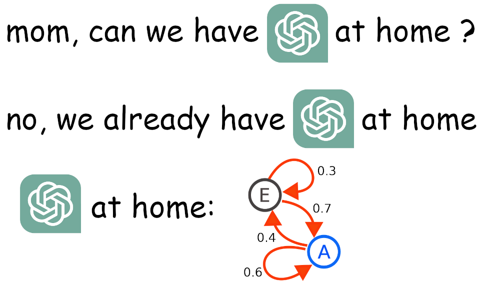

# chatgpt-at-home

A simple text generator based on n-grams and Markov chains:

``` shell
$ cargo run --release

> :train sources/shakespeare.txt

> ACT IV
ACT IV. Scene I.
The coast of Kent

Alarum. Enter Falstaff solus.

  Gent. Ay, gentle Thurio; for you are senseless.
  CLOTEN. I cannot forget
    But thou art not here.
  BARDOLPH. Sir John, as you may:
    Will tie you to this vault to die,
    Or with the Emperor in his banishment.
```

Interested, intrigued? See [my blog post](https://pwy.io/posts/look-ma-my-computer-is-talking)!



## Usage

There's an in-app intro, so you will find you way around it if you just run it:

``` shell
$ cargo run --release 
```

# License

Copyright (c) 2023, Patryk Wychowaniec <pwychowaniec@pm.me>.    
Licensed under the MIT license.
